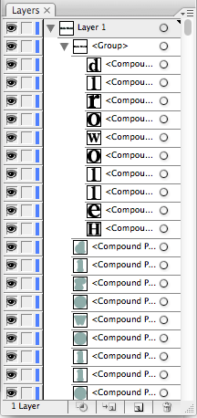
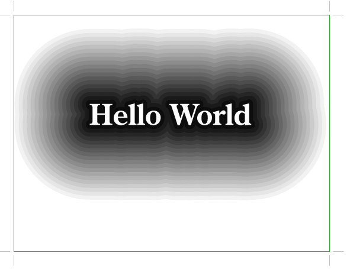

# Scripting Tutorial to Expanded Outlines

The final version of this script can be found here: [Expanded Outlines](https://github.com/ArtezGDA/illustratorPlugin-Examples/tree/master/expandedOutlines)

----

**Step 0: Start**  


### 1. Changed the font of the ExtendScript editor

The silly thing of the default **ExtendScript** editor font, is that it is not monospaced. Changing the font into a monospaced font will make reading the source code a lot easier

### 2. using `$.writeln()` to find the correct objects

```javascript
/* Expand Outlines - Multiple */

function duplicateOutline(obj, strokeW, color) {
}
function extraOutlines(objectGroup, strokeW, color) {
}
function buildOutlineStack(objectGroup) {
}

var doc = app.activeDocument;
var elements = doc.layers[0];
$.writeln (elements);
```

### 3. Study the different type of objects:

- documents
- layers
- groupItems
- compoundPaths
- pathItems
- ...

**Step 3.1: Investigate the layers**  


**Step 3.2: Printing the group(layer)**  

```diff
function duplicateOutline(obj, strokeW, color) {
function extraOutlines(objectGroup, strokeW, color) {
}
function buildOutlineStack(objectGroup) {
+		$.writeln (objectGroup);
+		var groups  = objectGroup.groupItems;
+		for (i = 0; i < groups.length; i++) {
+			$.writeln (groups[i]);
+		}
}
 
var doc = app.activeDocument;
var elements = doc.layers[0];
$.writeln (elements);
+buildOutlineStack(elements);
```

**Step 3.3: Adding strokes on all objects. Start of real work.**  

```diff
function buildOutlineStack(objectGroup) {
		var groups  = objectGroup.groupItems;
		for (i = 0; i < groups.length; i++) {
			$.writeln (groups[i]);
+			var group = groups[i];
+			
+			var compounds = group.compoundPathItems;
+			for (j = 0; j < compounds.length; j++) {
+				$.writeln(compounds[j]);
+				var compound = compounds[j];
+				
+				var paths = compound.pathItems;
+				$.writeln (paths.length);
+				for (k = 0; k < paths.length; k++) {
+					$.writeln(paths[k]);
+					var path = paths[k];
+					path.strokeColor = path.fillColor;
+					path.strokeWidth = 25.0;
+				}
+			}
		}
}
```

### 4. Study the creation of colors

**Step 4: Create grey outlines**  


### 5. Study the setting of Stroke caps and joins

**Step 5.1: adding greyish stroke. (Still is much easier done in Illustrator itself)**

```diff
/* Expand Outlines - Multiple */

-function duplicateOutline(obj, strokeW, color) {
+function duplicateOutline(compound, strokeW, color) {
+	var paths = compound.pathItems;
+	$.writeln (paths.length);
+	for (k = 0; k < paths.length; k++) {
+		$.writeln(paths[k]);
+		var path = paths[k];
+		path.strokeColor = color;
+		path.fillColor = color;
+		path.strokeWidth = strokeW;
+	}
}
function extraOutlines(objectGroup, strokeW, color) {
+	
+	var compounds = objectGroup.compoundPathItems;
+	for (j = 0; j < compounds.length; j++) {
+		$.writeln(compounds[j]);
+		var compoundObj = compounds[j];
+		
+		duplicateOutline(compoundObj, strokeW, color);
+	}
}
function buildOutlineStack(objectGroup) {
-		$.writeln (objectGroup);
-		var groups  = objectGroup.groupItems;
-		for (i = 0; i < groups.length; i++) {
-			$.writeln (groups[i]);
-			var group = groups[i];
-			
-			var compounds = group.compoundPathItems;
-			for (j = 0; j < compounds.length; j++) {
-				$.writeln(compounds[j]);
-				var compound = compounds[j];
-				
-				var paths = compound.pathItems;
-				$.writeln (paths.length);
-				for (k = 0; k < paths.length; k++) {
-					$.writeln(paths[k]);
-					var path = paths[k];
-					path.strokeColor = path.fillColor;
-					path.strokeWidth = 25.0;
-				}
-			}
-		}
+	$.writeln (objectGroup);
+	var groups  = objectGroup.groupItems;
+	for (i = 0; i < groups.length; i++) {
+		$.writeln (groups[i]);
+		var group = groups[i];
+		
+		var grey = new RGBColor();
+		grey.red = 144;
+		grey.green = 172;
+		grey.blue = 169;
+		extraOutlines(group, 20.0, grey);
+	}
}

var doc = app.activeDocument;
```

### 6. Get bitten by the ***recursive duplication trap***

```diff
```

### 7. Fix the recursive bug with extra count variable and place at end

**Step 7: Place the new elements at the end**  


**Step 7.1: Duplication works**  


```diff
```

### 8. Improved place at end.

### 9. Start simple

**Step 9: Start Simple**  


### 10. Fixed 2nd recursive bug (by using targetGroup)

**Step 11: Finished work**  



