# Scripting Tutorial to Import JSON Data into Illustrator

The final version of this script can be found here: [Import JSON Data into Illustrator](https://github.com/ArtezGDA/illustratorPlugin-Examples/tree/master/importJsonData)

----

### 0. Start with an Illustrator document with the elements we want to modify

- A layer called **TextLayer** with 12 text objects
- A layer called **ShapeLayer** with a single shape
- A layer called **CenterMark** with just a circle centered on (300pt, 500pt) as center mark, to be ignored.

**Step 0: Start with an Illustrator document with a path shape**  
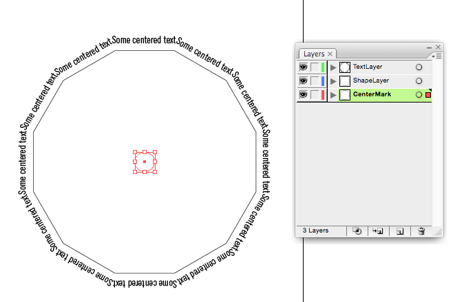

### 1. Logging the name of each layer

We assume you're already a bit familiar with the basic setup of Extend Scripts: Why you would use `$.writeln(...)` and where the result of these *writeln* shows up (The Javascript Console in Adobe's ExtendScript ToolKit application).

Also, you should be familiar with getting the activeDocument, if there is any:

```javascript
if ( app.documents.length > 0 ) {
	var doc = app.activeDocument;
}
```

Then, as the first step in our endeavor, we want to log / print the name of each layer in your document.

**Step 1: Log the name of each layer.**

```javascript
// Import JSON Data into Illustrator

// Get the active document
if ( app.documents.length > 0 ) {
	var doc = app.activeDocument;
	
	// Get all layers
	var layers = doc.layers;
	if ( layers.length > 0 ) {
		for (var i = 0; i < layers.length; i++) {
			var layer = layers[i];
			
			// Of each layer, print the name
			$.writeln(layer.name)
		}
	}
}
```

### 2. Single out the "TextLayer"

Next we want to focus only on the text layer, i.e. the layer we called "TextLayer", the layer which contains the text objects that we would like to modify. We've put the text to be modified in its own special layer, since we might have other layers with text as well, which we do not want to modify. So, let's single out the text layer: 

**Step 2: Single out the layer called "TextLayer"**

```javascript
			if ( layer.name == "TextLayer" ) {
				$.writeln(layer);
			}
```

**Step 2.1: Javascript Console: confirm that singling out the layer called "TextLayer" worked**  
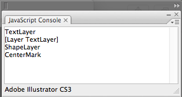

### 3. Generalize the *getting a named layer* into a function

We now have build some code that only acts on a layer with a specific name. This is so useful, that we might want to reuse the code. In order to be able to do so, let's generalize it into its own function:

- Move the code that selects a single layer into its own function at the top of our file
- Make the function return the layer, or `null` if there is no layer with that name.
- This function also takes a document from where it should search the layer.
- Call the function with the activeDocument `doc` and the name of the layer *"TextLayer"*.

**Step 3: Generalized function for getting a named layer and calling that function**

```javascript
// Import JSON Data into Illustrator

// Returns the layer with the given name
function getLayerNamed(doc, nameOfTheLayer) {
	
	// Only search the document if it is given
	if ( doc != undefined ) {
		
		// Get the layer with the given name 
		var layers = doc.layers;
		if ( layers.length > 0 ) {
			for (var i = 0; i < layers.length; i++) {
				var layer = layers[i];
			
				if ( layer.name == nameOfTheLayer ) {
					return layer;
				}
			}
		}
	}
	return null;
}

// Get the active document
if ( app.documents.length > 0 ) {
	var doc = app.activeDocument;
	
	var textLayer = getLayerNamed(doc, "TextLayer");
	$.writeln(textLayer);
}
```

### 4. Print all texts in the textLayer

Next, we want get all the text objects of the layer and print these out. The text objects in Illustrator are called *textFrame*s and they can be accessed by `layer.textFrames`. Then we use a similar construct as with getting the layers in the document: store the textFrames in a variable, checking the length of that variable to make sure that textFrames is not empty, looping through all the textFrames and finally printing the text (`contents`) of each textFrame.

**Step 4: Print the texts of each textFrame**

```diff
   var textLayer = getLayerNamed(doc, "TextLayer");
-   $.writeln(textLayer);
+   
+   // Print all texts in the textLayer
+   var textObjects = textLayer.textFrames;
+   if ( textObjects.length > 0 ) {
+       for (var i = 0; i < textObjects.length; i++) {
+           var textObj = textObjects[i];
+
+           $.writeln(textObj.contents);
+		}
+	}
```

### 5. Modify the texts

As intermediate result, let's modify the texts of these textFrames. It's not the final text of these textFrames, but at least we'll see a effect of all our hard work in the Illustrator document itself.

```diff
           $.writeln(textObj.contents);
+           textObj.contents = "New text";
```

**Step 5.1: Modify the texts as intermediate result**  
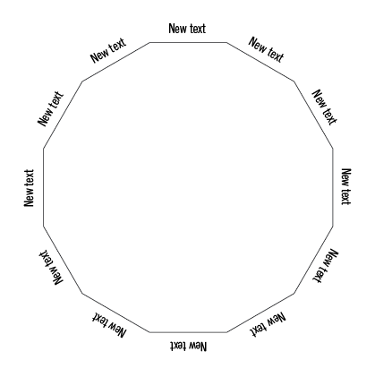

### 6. Append the index `i` to the texts

Just to get a feeling of the order of the elements and which one is the first one and which one the last, let's append the index `i` to the texts that we're modifying.

```diff
           $.writeln(textObj.contents);
-           textObj.contents = "New text";
+           textObj.contents = "New text" + i.toString();
```

**Step 6.1: Append the index to the modified texts**  
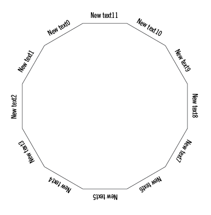

### 7. Change the order of the text modifications

From the previous screenhot we can observe that the order is exactly the reverse of what is intended. This reverse order is due to the way of duplicating items in Illustrator: the new duplicated item is placed on top. Because we intented a reverse order: it should start at the top and then increment clockwise, we need to reverse the order of modified textFrames. We could do this by reversing the order of textFrame layers in Illustrator or by modifying our script. We'll do the latter:

```diff
   if ( textObjects.length > 0 ) {
       for (var i = 0; i < textObjects.length; i++) {
-           var textObj = textObjects[i];
+           var textObj = textObjects[textObjects.length - (i + 1)];
           
           $.writeln(textObj.contents);
```

**Step 7.1: Reverse the order in which the texts are changed**  
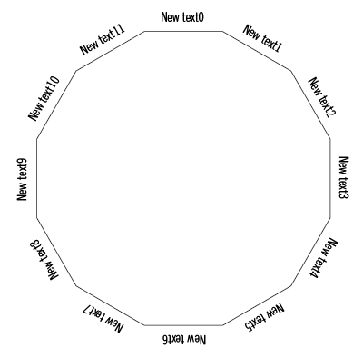

### 8. Study reading from JSON

According to FabianTheBlind [Eval is Evil](https://github.com/fabiantheblind/extendscript/wiki/Read-In-JSON-From-File-And-DONT-Eval). He explains the proper way how to read from a JSON file.

However, this method didn't work for me, and gives a parsing error. Maybe this has to do with the old version of Illustrator that I am using, so there might be fixes. But I had to look for an alternative.

The only alternative which works for me, is to resort to the "*dangerous*" `eval` method.

(`Eval` is considered dangerous, because it will execute any code it will find in the (json) file to read. So if you don't control your own json, you better not use the following.)

**Step 8.1: Load some JSON data with the `eval` method**  

Add an example JSON file somewhere on your computer:

[`example.json`](importJsonData/example.json):

```json
{	"foo": "Hello World",
	"bar": 42
}
```

Then append this to your script. *Of course you will have to change the path to the* example.json *file to the path on your computer.* 

```javascript
// JSON reading
var fileToRead = File("~/Work/Artez/ArtezGDARepos/illustratorPlugin-Examples/importJsonData/example.json");
var jsonData = null;
if ( fileToRead !== false ) {
	// Open the file and read the content
	fileToRead.open('r');
	content = fileToRead.read();
	// modify the content so it will set the jsonData variable
	content = "jsonData = " + content + ";";
	// eval is evil, but other tricks didn't seem to work
	eval(content);
	// Close the file
	fileToRead.close();
}

// Print some data from the JSON
$.writeln(jsonData.foo);
$.writeln(jsonData.bar);
```

**Step 8.2: The successful result from reading the JSON in the Javascript Console**  
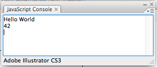

### 9. Read an array from JSON

Now let's head over to our (real) data file and import this file instead of the extreme simple example of above.

Actually, this is still sample data but for the purpose of drawing a graph it will do fine. The json contains a list of 12 months with a value for each months.

[`arrayOfMonths.json`](importJsonData/arrayOfMonths.json):

```json
{
	"exampleArray": [
		{
			"month": "January",
			"value": 32
		},
		{
			"month": "February",
			"value": 25
		},
...
```

Change the script to import this new file:

```diff

// JSON reading
-var fileToRead = File("~/Work/Artez/ArtezGDARepos/illustratorPlugin-Examples/importJsonData/example.json");
+var fileToRead = File("~/Work/Artez/ArtezGDARepos/illustratorPlugin-Examples/importJsonData/arrayOfMonths.json");
var jsonData = null;
if ( fileToRead !== false ) {
```

```diff
}

-// Print some data from the JSON
-$.writeln(jsonData.foo);
-$.writeln(jsonData.bar);
+// Print number of months in the JSON array
+$.writeln(jsonData.exampleArray.length);
```

### 10. Refactor the JSON reading into a function

Because we are only interested in getting this array, let's move all the code necessary to get to that array into its own function. Functionally this step won't change the behavior of our code a single bit, but after this '*refactor*' (restructuring the code, while the functionality stays the same), it will be much easier to read.

What we would like to have is a function that just returns the array

```javascript
// Returns an array of 12 months
function getMonthsArray() {
	// JSON reading
	var fileToRead = File("~/Work/Artez/ArtezGDARepos/illustratorPlugin-Examples/importJsonData/arrayOfMonths.json");
	var jsonData = null;
	if ( fileToRead !== false ) {
		// Open the file and read the content
		fileToRead.open('r');
		content = fileToRead.read();
		// modify the content so it will set the jsonData variable
		content = "jsonData = " + content + ";";
		// eval is evil, but other tricks didn't seem to work
		eval(content);
		// Close the file
		fileToRead.close();
	}
	return jsonData.exampleArray
}
```

Then when we want to get the array we can just get it and appoint it to a variable

```javascript
var months = getMonthsArray();
```

### 11. Use the array to change the texts

So now we can use this array to change the texts.

**Step 11.1: Get the array of months (within the block if it has texts to change)**

```diff
    var textObjects = textLayer.textFrames;
    if ( textObjects.length > 0 ) {
+       
+       // Get the months
+       var months = getMonthsArray();
+
        for (var i = 0; i < textObjects.length; i++) {
            var textObj = textObjects[textObjects.length - (i + 1)];
```

**Step 11.2: Wrap the for loop in an `if` that only executes if the number of texts matches the number of months**

```diff
+       // Check if the number of textObjects is equal to the number of months
+       if ( textObjects.length == months.length ) {
+           
            for (var i = 0; i < textObjects.length; i++) {
                var textObj = textObjects[textObjects.length - (i + 1)];
            
				$.writeln(textObj.contents);
				textObj.contents = "New text" + i.toString();
            }
+       } else {
+
+           // If the number of the texts is not equal to the number of months, alert the user
+           alert("the number of textFrames and number of months in the JSON do not match.");
+       }
    }
```

Technically, it is possible to also change the text frames when the number of text frames and months do not match. (If there are more months than textFrames, just ignore the superfluos data. If there are more textFrames than months, leave the extra textFrames untouched). But that requires more checks and more code. In this case we know that they match, so go for the easy way.

**Step 11.3: Use the actual data -the month name- to change the texts**

```diff
			for (var i = 0; i < textObjects.length; i++) {
				var textObj = textObjects[textObjects.length - (i + 1)];
			
+				// Change the text into the month
+				var thisMonth = months[i];
+				textObj.contents = thisMonth.month;
			}
		} else {
```

**Step 11.4: The result from reading an example JSON file and modifying the texts to the names of months**  
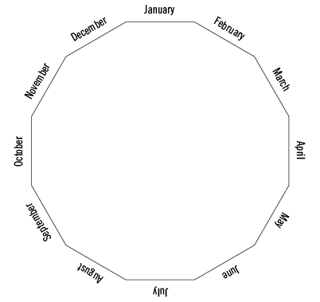

### 12. Investigate the points of the path 

Now we modified the Illustrator document to show a nice list of months, let's focus on the polygon path.

The layer called "ShapeLayer" contains a single object, a *path*, with 12 points. 

**Step 12.0: Investigate the polygon path**  
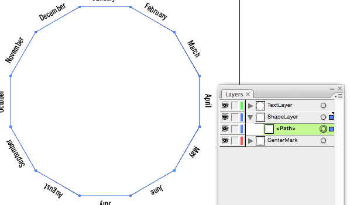

Let's see how we can access those through code. Begin by getting the shape layer. We can use the function `getLayerNamed` that we created earlier.

**Step 12.1: Begin by getting the shape layer**

```javascript
	var pathLayer = getLayerNamed(doc, "ShapeLayer")
```

Then get to the path in this layer. From the Reference about the object *Layer*, we see that there is the property `pathItems` which we could use:

**Step 12.2: Layer Reference: the pathItems property**  
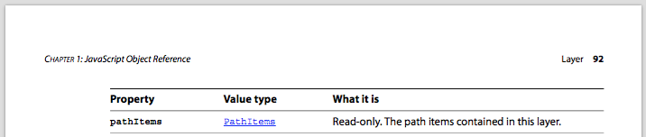

This will give us *PathItems*, a collection of *PathItem*(s). Studying the *PathItem* teaches us that there is read-only property `pathPoints`, returning a list, *PathPoints*.

**Step 12.3: PathItem Reference: the pathPoints property**  


The *PathPoints* is a collection of multiple *PathPoint*(s). And if we study its reference we find just a few properties each point has, the `anchor` probably being most notable: the location of the point.

**Step 12.4: PathPoint Reference**  
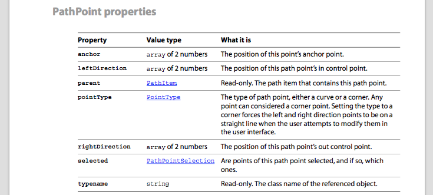

So now we know how to access these properties. Let's just get the first point of the polygon, and see if we can access some of its properties:

```javascript
	// Print the pathItems of the pathLayer
	$.writeln(pathLayer.pathItems);
	
	// Print the first (and only) pathItem
	$.writeln(pathLayer.pathItems[0]);
```

**Step 12.5: Getting the PathItem**  
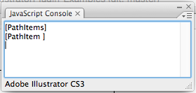

We have the *PathItem*. Now count its *pathPoints*:

```javascript
	// Make this PathItem into a variable
	var polygonPath = pathLayer.pathItems[0];
	
	// Print the number of pathPoints in this PathItem 
	$.writeln(polygonPath.pathPoints.length);
```

**Step 12.6: Count the pathPoints**  
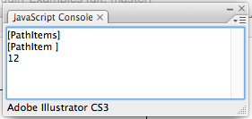

Yeah, **12** points! So far so good.

Now let's just take the *first* point of those twelve and read some of its properties. Whenever you're trying to manipulate a bunch of things, it is often easier just to try it with one or a few first, to see how they hold up, before you attempt it on the lot.

```javascript
	// For experimentation, get the first point
	var firstPoint = polygonPath.pathPoints[0];
	
	// Print the anchor (which is a coordinate) and the pointType
	$.writeln(firstPoint.anchor);
	$.writeln(firstPoint.pointType);
```

**Step 12.7: Investigate the first point**  
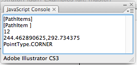

So, indeed the the `anchor` is a list of coordinates, and the `pointType` is a `PointType.CORNER`.

### 13. Investigate further: manipulate the points in the path

Printing out stuff to the console is just one part of an investigation. If you really want to understand how stuff is working, you should take it apart, tweak it, poke it with a stick and see how it reacts. So let's.

Manipulate the anchor. The documentation says the anchor should be an *array of 2 numbers*. So that's what we should set it to. I'm gonna set the coordinates of the anchor to the center of the shape, as if the value of this point would be 0:

```javascript
	// Modify the coordinates of the first anchor
	// (300.0, 500.0) is the center of the drawing
	firstPoint.anchor = [300.0, 500.0];
```

**Step 13.1: Manipulate the first point**  
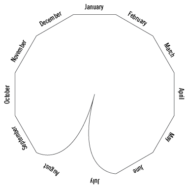

A few things to be noticed:

- The manipulated point is not the first point at the top (what we might were expecting), but a point somewhere halfway down. This is probably due to the way I have been drawing the polygon in the first place and where I have been holding the mouse. That wasn't important before, but now turns out to matter.
- The lines coming from the point are not straight, there seem to be a *curve* toward its neighboring points. This is also something we'll need to fix.

Firstly, we're going to concentrate on this last aspect. Curve lines might be nicer that straight lines. But curved lines will also be harder to control than straight lines. So today we're going to make them straight. And maybe someday later, we'll figure out how to make them nice and curved.

So straight is what we want, but do not get. What is wrong here?

**Step 13.2: Why the Curved lines?**  
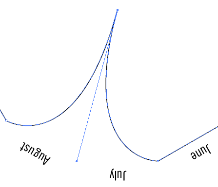

Investigating the curve and its bendpoints further, it seems that the *control points*, both *in* and *out* control points were not moved accordingly to the script, but did just stay at their original position.

We can change this by also setting the control points to these same coordinates as the moved anchor.

```javascript
	firstPoint.anchor = [300.0, 500.0];
	firstPoint.leftDirection = [300.0, 500.0];
	firstPoint.rightDirection = [300.0, 500.0];
```

**Step 13.3: Setting the whole corner: both the anchor and its control points**  
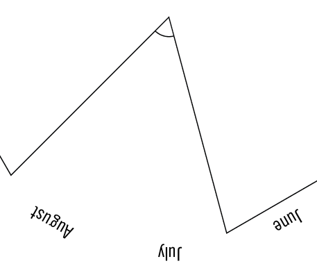

Then onto the starting position (and direction) of the drawing. We could try to fix this problem in code. But it will probably be much easier if we're just adjusting the starting point of the polygon by rotating it using Illustrator's interface:

**Step 13.4: First corner at the top**  
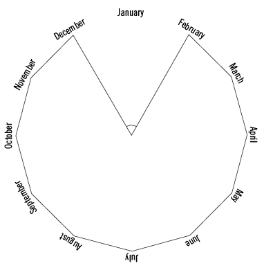

There is last more thing we need to find out during this investigation step: What is the direction of polygon? (I.e. in which direction will you be following the corner points?)

Try to set the second point to the center as well.

```javascript
	// Modify the second point to investigate the direction
	var secondPoint = polygonPath.pathPoints[1];
	secondPoint.anchor = [300.0, 500.0];
```

**Step 13.5: Manipulate the second point to learn about direction**  
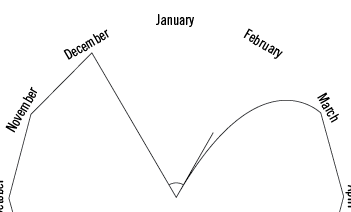

Nice, the direction is the the same as prefered, so we do not need to change something about that.

### 14. Calculate the point we want to manipulate

Next, we need to calculate the `x`- and `y`-coordinate of the point that we want to manipulate. We know we have to set the *PathPoint*'s `anchor`, `leftDirection` and `rightDirection` to the new position. But what *is* this new position?

**Step 14.0: Geometry of a manipulated point**  
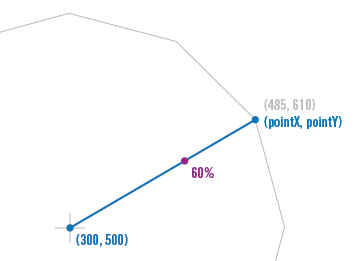

Let's do an example calculation for manipulating a point on the polygon (*pointX*, *pointY*). The center of the polygon is at `[300, 500]`, the original point at `[485, 610]` and the amount we want to set it to is `60`.

> As you can see, if you would analyze the `arrayOfMonths.json`, is that all of its values are between `0` and `100`. That is on purpose to make this calculation easier. If your data has different ranges and extremes, you'll of course have to adjust the calculations accordingly.

The calculation for the manipulated point goes as follows:

Take the offset of the original point from the center (in other words: *the vector* from the center to the original point):

`[pointX - centerX, pointY - centerY]` or `[485 - 300, 610 - 500] = [185, 110]`

Of this vector we want only `60%` or `(60 / 100)`, so lets multiply our vector by this `0.6`:

`[185, 110] * 0.6 = [111, 66]`

So the adjusted vector from the center is `[111, 66]`. Add back the coordinates of the center:

`[centerX + 111, centerY + 66]`. And there we have our adjusted point: `[411, 566]`

**Step 14.1: In code it would something like this:**

For testing, first create a variable `point`. (We'll reuse the variable `secondPoint`)

```javascript
	var point = secondPoint;
```

Then the calculation:

```javascript
	// Create the centerPoint
	var centerPointX = 300.0;
	var centerPointY = 500.0;
	
	// Get the original Point
	var origPointX = point.anchor[0];
	var origPointY = point.anchor[1];
	
	// Calculate the adjustment ratio
	var adjustment = 60.0 / 100.0;

	// Calculate the adjusted vector from the center
	var vectorX = (origPointX - centerPointX) * adjustment;
	var vectorY = (origPointY - centerPointY) * adjustment;

	// Calculate the new point
	var newX = centerPointX + vectorX;
	var newY = centerPointY + vectorY;
```

Conclude with setting the `point`'s position:

```javascript
	point.anchor = [newX, newY];
	point.leftDirection = [newX, newY];
	point.rightDirection = [newX, newY];
```

### 15. Manipulate each point of the path

Finally, we can put this all together. We put this code above (of step 14) inside the `for` loop which we already have to change the text.

First get the actual point for each `i`:

```javascript
				var point = polygonPath.pathPoints[i];
```

Then modify the calculation to use the actual value instead of the dummy `60`:

```diff
				var origPointY = point.anchor[1];
	
				// Calculate the adjustment ratio
-				var adjustment = 60.0 / 100.0;
+				var adjustment = thisMonth.value / 100.0;

				// Calculate the adjusted vector from the center
				var vectorX = (origPointX - centerPointX) * adjustment;
```

That is it!

The final code of [`importJsonData.jsx`](importJsonData/importJsonData.jsx):

```javascript
// Import JSON Data into Illustrator

// Returns the layer with the given name
function getLayerNamed(doc, nameOfTheLayer) {
	
	// Only search the document if it is given
	if ( doc != undefined ) {
		
		// Get the layer with the given name 
		var layers = doc.layers;
		if ( layers.length > 0 ) {
			for (var i = 0; i < layers.length; i++) {
				var layer = layers[i];
			
				if ( layer.name == nameOfTheLayer ) {
					return layer;
				}
			}
		}
	}
	return null;
}

// Returns an array of 12 months
function getMonthsArray() {
	// JSON reading
	var fileToRead = File("~/Work/Artez/ArtezGDARepos/illustratorPlugin-Examples/importJsonData/arrayOfMonths.json");
	var jsonData = null;
	if ( fileToRead !== false ) {
		// Open the file and read the content
		fileToRead.open('r');
		content = fileToRead.read();
		// modify the content so it will set the jsonData variable
		content = "jsonData = " + content + ";";
		// eval is evil, but other tricks didn't seem to work
		eval(content);
		// Close the file
		fileToRead.close();
	}
	return jsonData.exampleArray
}


// Get the active document
if ( app.documents.length > 0 ) {
	var doc = app.activeDocument;
	
	var textLayer = getLayerNamed(doc, "TextLayer");
	var pathLayer = getLayerNamed(doc, "ShapeLayer")
	
	// Print the pathItems of the pathLayer
	$.writeln(pathLayer.pathItems);
	
	// Print the first (and only) pathItem
	$.writeln(pathLayer.pathItems[0]);
	
	// Make this PathItem into a variable
	var polygonPath = pathLayer.pathItems[0];
	
	// Change all texts in the textLayer
	var textObjects = textLayer.textFrames;
	if ( textObjects.length > 0 ) {
		
		// Get the months
		var months = getMonthsArray();
		
		// Check if the number of textObjects is equal to the number of months
		if ( textObjects.length == months.length ) {
			
			for (var i = 0; i < textObjects.length; i++) {
				var textObj = textObjects[textObjects.length - (i + 1)];
			
				// Change the text into the month
				var thisMonth = months[i];
				textObj.contents = thisMonth.month;
				
				// Modify each point
				var point = polygonPath.pathPoints[i];
	
				// Create the centerPoint
				var centerPointX = 300.0;
				var centerPointY = 500.0;
	
				// Get the original Point
				var origPointX = point.anchor[0];
				var origPointY = point.anchor[1];
	
				// Calculate the adjustment ratio
				var adjustment = thisMonth.value / 100.0;

				// Calculate the adjusted vector from the center
				var vectorX = (origPointX - centerPointX) * adjustment;
				var vectorY = (origPointY - centerPointY) * adjustment;

				// Calculate the new point
				var newX = centerPointX + vectorX;
				var newY = centerPointY + vectorY;
				
				// Set the anchor and its control points to the new point
				point.anchor = [newX, newY];
				point.leftDirection = [newX, newY];
				point.rightDirection = [newX, newY];
				
			}
		} else {
			
			// If the number of the texts is not equal to the number of months, alert the user
			alert("the number of textFrames and number of months in the JSON do not match.");
		}
	}
}
``` 

If you have Illustrator run this code on the document, it will result in this.

**Step 15.0: Final result of the document modified by the data**  
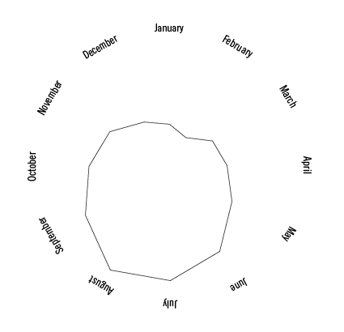
